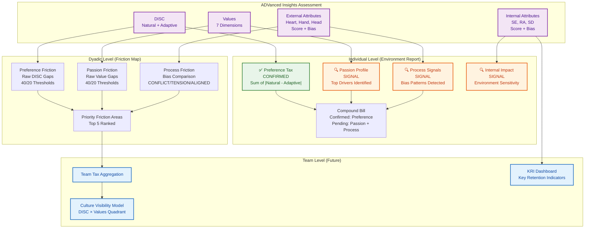
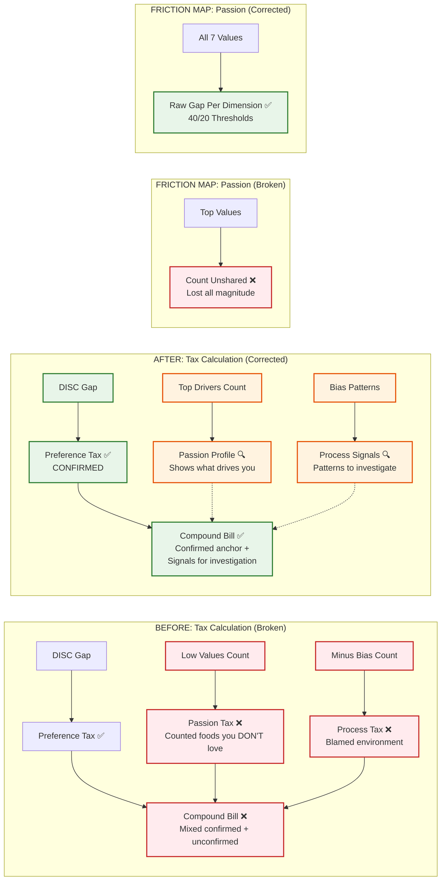
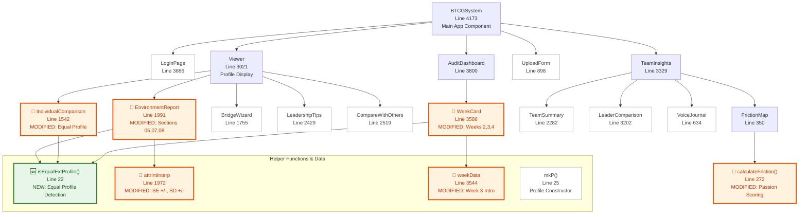

# OrgHarmony LWYL App — Session Handoff & Code Wiki

**Session Date:** March 5, 2026  
**Company:** OrgHarmony (formerly BTCG Consulting)  
**Framework:** Bridging the Connection Gap (BTCG)  
**Initiative:** Love Where You Lead (LWYL)  
**File Modified:** `src/app/page.jsx` (4,846 lines)  
**Total Changes:** 9 corrections across 3 features  
**Deployment:** VS Code → Git Push → Vercel auto-deploy

---

## Table of Contents

1. [Executive Summary](#1-executive-summary)
2. [Architecture Overview](#2-architecture-overview)
3. [Technology Stack](#3-technology-stack)
4. [Project Structure](#4-project-structure)
5. [Component Map](#5-component-map)
6. [Bugs Fixed (3)](#6-bugs-fixed)
7. [Methodology Corrections (6)](#7-methodology-corrections)
8. [What Was NOT Changed](#8-what-was-not-changed)
9. [Strategic Decisions](#9-strategic-decisions)
10. [Deployment & Testing](#10-deployment--testing)
11. [Next Session Roadmap](#11-next-session-roadmap)

---

## 1. Executive Summary

### Why This Session Happened

Daniel identified a foundational validity issue: the app was assigning Passion Tax and Process Tax to individuals upon assessment completion, but individual assessment data alone cannot confirm whether someone's environment is starving their passions or suppressing their process. The data shows what a person NEEDS — it does not show what the environment PROVIDES.

The Preference Tax (DISC) does not have this problem because the assessment captures BOTH Natural and Adaptive styles. The gap between those two IS the environment's fingerprint. Values and Attributes have no equivalent "adaptive" measure.

### What Was Accomplished

| Category | Count | Description |
|----------|-------|-------------|
| **Bugs Fixed** | 3 | Self-Esteem +/− identical text, Self-Direction +/− swapped, No equal profile protocol |
| **Methodology Corrections** | 6 | Process Tax → Signals, Compound Bill alignment, Passion Tax formula, Audit Week 4, Friction Map Passion scoring, Causal language removal |
| **Features Affected** | 3 | Environment Report, Environment Audit, Friction Map |
| **Lines Modified** | ~250 | Across a 4,846-line file |

### Company Context

| Element | Description |
|---------|-------------|
| **OrgHarmony** | A transformation company that helps leaders create environments where people thrive |
| **BTCG** | The conflict resolution framework (Bridging the Connection Gap) |
| **Love Where You Lead** | The leader initiative — Leaders First approach |
| **Core Question** | "Do you love where you lead, or do you love that you're the leader?" |
| **Core Principle** | The purpose is transformation, not information |

---

## 2. Architecture Overview

### Tax Methodology System

The following diagram shows how assessment data flows through the tax calculation system after corrections. Green = confirmed from data. Orange = signal requiring additional input. Blue = future features.



### Data Flow: Before vs. After Corrections

This diagram shows what changed in the tax calculation logic — the broken formulas on the left, the corrected approach on the right.



### Three Measurement Levels

| Level | What It Measures | Data Source | Status |
|-------|-----------------|-------------|--------|
| **Preference (DISC)** | Behavioral adaptation cost | Natural vs. Adaptive (TWO data points) | ✅ Confirmed from individual data |
| **Passion (Values)** | Motivational alignment | Motivator scores (ONE data point) | 🔍 Signal — needs Environment Alignment or team data |
| **Process (External Attributes)** | Decision-making utilization | Score + Bias (TWO data points) | 🔍 Signal — bias pattern worth investigating |
| **Internal Impact (Internal Attributes)** | Environment permeability | Score + Bias (TWO data points) | 🔍 Signal — Key Retention Indicator at team level |

---

## 3. Technology Stack

| Technology | Version | Purpose |
|-----------|---------|---------|
| **Next.js** | 16.1.6 | React framework with server-side rendering |
| **React** | 19.2.3 | UI component library |
| **Supabase** | ^2.97.0 | Backend — authentication + database |
| **Recharts** | ^3.7.0 | Data visualization (bar charts, pie charts) |
| **Tailwind CSS** | ^4 | Utility-first styling (used in layout.tsx) |
| **Vercel** | — | Hosting and auto-deployment from Git |

---

## 4. Project Structure

```
lwyl-app-main/
├── src/
│   ├── app/
│   │   ├── page.jsx          ← 4,846 lines — ALL app logic lives here
│   │   ├── layout.tsx         ← Root layout with Inter font
│   │   └── globals.css        ← Global styles
│   └── lib/
│       └── supabase.js        ← Supabase client + auth + data helpers
├── package.json
├── next.config.ts
├── supabase-schema.sql        ← Database schema
├── tsconfig.json
└── [8 .md specification files]
```

**Architecture Note:** The entire application — 25 React components, 6 utility functions, 15 seed profiles, interpretation engines, and all feature logic — lives in a single file (`page.jsx`). This is a monolithic single-page architecture deployed as a Next.js app.

---

## 5. Component Map

### Modified Components (This Session)



### Complete Component Registry

| Component | Line | Purpose | Modified? |
|-----------|------|---------|-----------|
| `BTCGSystem` | 4173 | Main app component — routing, auth, state | No |
| `LoginPage` | 3886 | Authentication UI | No |
| `Viewer` | 3021 | Individual profile display with tabs | No |
| `EnvironmentReport` | 1991 | 8-section Environment Report modal | **Yes — Sections 05, 07, 08** |
| `IndividualComparison` | 1542 | Leader-to-member side-by-side | **Yes — Equal profile handling** |
| `BridgeWizard` | 1755 | Connection Agreement creation wizard | No |
| `LeadershipTips` | 2429 | Coaching tips based on comparison | No |
| `CompareWithOthers` | 2519 | Compare any two profiles | No |
| `TeamInsights` | 3329 | Team-level aggregate views | No |
| `FrictionMap` | 350 | Pairwise friction matrix + detail | **Yes — Passion scoring + display** |
| `TeamSummary` | 2282 | One-page summaries per team member | No |
| `LeaderComparison` | 3202 | Leader vs. full team comparison | No |
| `VoiceJournal` | 634 | Audio reflection journaling | No |
| `AuditDashboard` | 3800 | 4-week Environment Audit UI | No (sidebar badge not updated) |
| `WeekCard` | 3586 | Individual week in Environment Audit | **Yes — Weeks 2, 3, 4** |
| `UploadForm` | 898 | Assessment PDF upload + manual entry | No |

### Modified Helper Functions & Data

| Helper | Line | Purpose | Change |
|--------|------|---------|--------|
| `isEqualExtProfile()` | 22 | **NEW** — Detects equal External Attribute profiles | Added |
| `attrIntInterp` | 1972 | Internal Attribute interpretation text | Self-Esteem +/−, Self-Direction +/− corrected |
| `weekData[2]` | 3570 | Week 3 intro text | Causal language removed |
| `calculateFriction()` | 272 | Pairwise friction scoring | Passion scoring → raw gaps |

---

## 6. Bugs Fixed

### Bug 1: Self-Esteem (+) Strong Ego — Missing Interpretation

**Location:** `attrIntInterp["Self-Esteem"]` — Line 1973  
**Severity:** Critical — displayed factually incorrect information to users

**Problem:** Both `+` (Strong Ego) and `−` (Humility) showed identical text: "You undervalue your own worth." A leader with Strong Ego was told they undervalue themselves — the exact opposite of reality.

**Profiles Affected:** Timothy Hurd (8.8, +), Lamarr Miller (8.8, +), and any future profile with Self-Esteem + bias.

| Bias | Before (Broken) | After (Corrected) |
|------|-----------------|-------------------|
| **+ Strong Ego** | "You undervalue your own worth. You may dismiss your contributions, defer too quickly, or need external validation to feel confident." | "You have a strong sense of your own value. You are self-assured and confident in your abilities. Criticism rarely shakes your self-image, but it may also mean feedback doesn't land the way others intend it to." |
| **− Humility** | *(identical to + above)* | "You undervalue your own worth. You may dismiss your contributions, defer too quickly, or need external validation to feel confident. Your environment's messages about 'enough' affect you deeply." |
| **= Balanced** | "You have a stable sense of your own worth." | "You have a somewhat settled view of your own worth. You can receive feedback without it destabilizing your identity, but you may not be strongly motivated to grow in this area." |

**Source:** The_DISC_Values_Attributes_Perspective.pdf, Advanced_Insights__Frameworks.pdf

---

### Bug 2: Self-Direction (+) and (−) Were Swapped

**Location:** `attrIntInterp["Self-Direction"]` — Line 1975  
**Severity:** Critical — 73% of profiles (11 of 15) received wrong interpretation

**Problem:** The `+` (Stubborn) text said: "You require significant guidance and structure from external sources to operate effectively. Independence is taxing." That describes Persuadable (−). The `−` text described Stubborn (+). They were completely backwards.

| Bias | Before (Swapped) | After (Corrected) |
|------|------------------|-------------------|
| **+ Stubborn** | "You require significant guidance and structure from external sources to operate effectively. Independence is taxing." | "You are locked onto your direction. You have solidified confidence about your path and future. Detours feel like defeat, not flexibility. Your environment can slow you but not easily redirect you." |
| **− Persuadable** | "You undervalue external direction. You may resist coaching, skip collaboration, or overestimate your own self-sufficiency." | "You are open to influence and direction from others. Strong voices around you can redirect your path. You may need external guidance to feel confident about your direction." |

**Source:** Advanced_Insights__Frameworks.pdf — Self-Direction bias definitions

---

### Bug 3: Equal Profile Protocol — No Rule Existed

**Location:** New helper `isEqualExtProfile()` at Line 22 + 4 rendering locations  
**Severity:** High — arbitrary sequence assigned to equal-capacity profiles

**Problem:** When External Attribute scores are within 0.5 of each other (e.g., Daniel's 8.3/8.3/8.3), JavaScript's sort is arbitrary. The app displayed a false 1/2/3 sequence. The Environment Report Complete Reference explicitly states: "When external scores are EQUAL, there is no processing sequence. Versatility IS the story."

**Rule Established:** Gap between max and min External score ≤ 0.5 = Equal Profile. > 0.5 = Sequenced Profile.

| Location | Before | After |
|----------|--------|-------|
| Environment Report Section 05 | Shows arbitrary 1/2/3 sequence | Shows "=" for all three, "Versatile Profile" label, explanation that versatility IS the strength |
| Leader-to-Individual Comparison | Numbered sequence for equal profiles | Shows "(Versatile)" badge with "=" indicators |
| Environment Audit Week 3 | Shows "Decision Order" with numbers | Shows "Versatile Profile (Equal Capacity)" with "=" |

**Source:** Environment_Report_Complete_Reference.md.pdf — Score Equality Rule

---

## 7. Methodology Corrections

### Correction 1: Process Tax → Process Signals (Environment Report Section 07)

**Location:** Lines 2234-2246  
**What Changed:** Section title, description, tax card labels, and narrative text

**Before:** "PROCESS TAX — Where Capacity Is Being Lost" with text "Every minus (−) bias on an External Attribute means you have a lens your environment has conditioned you not to trust."

**After:** "PROCESS SIGNALS — Patterns Worth Examining" with text "A minus (−) bias means you have a lens you are not fully leveraging — this could be environment-driven, experience-driven, or a natural preference. The Environment Alignment can help determine the source."

**Reasoning:** The Innermetrix framework defines each External bias differently. Practical Thinking (−/Frustrated) explicitly references past environment damage. Empathy (−/Undervalue) and Systems Judgment (−/Autonomy) do not carry the same environmental evidence. A blanket causal claim is not psychometrically defensible from individual data alone.

---

### Correction 2: Compound Bill Alignment (Environment Report Section 08)

**Location:** Lines 2248-2279  
**What Changed:** Section title, description, tax cards, verdict logic

**Before:** Combined Preference Tax (confirmed) with Process Tax (unconfirmed) into single Heavy/Moderate/Light label.

**After:** Separates confirmed from pending. Shows "Preference Tax: [Level] — confirmed" alongside "Process Signals: [X patterns] — to examine." Verdict driven by CONFIRMED Preference Tax only.

**Reasoning:** Mixing confirmed and unconfirmed data into a single verdict creates false precision. When an I/O Psychologist asks "How do you know the compound bill is Heavy?", the answer must trace to defensible data.

---

### Correction 3: Passion Tax Formula (Environment Audit Week 2)

**Location:** Lines 3633-3653  
**What Changed:** Tax calculation formula and display labels

**Before:** `passionTax = lowVals.length` — counted values scoring below 40. Label: "Your Passion Tax"

**After:** Shows "Passion Profile" with count of active top drivers. Label: "Your Passion Profile"

**Reasoning:** Counting low values measures what DOESN'T motivate the person. Having 4 values you don't love is not a tax — it's normal. The tax is whether your TOP motivators are being fed or starved, which requires environment data. The corrected language: "Whether your environment honors or starves these determines your Passion Tax. That requires examining your environment, not just your profile."

---

### Correction 4: Environment Audit Week 4 Compound Bill

**Location:** Lines 3699-3729  
**What Changed:** All three tax calculations and compound verdict

**Before:** Combined Preference Tax + wrong Passion Tax (low values count) + Process Tax (minus bias count) into single compound label.

**After:** Shows Preference Tax as confirmed anchor. Passion shown as "Passion Profile" with driver count. Process shown as "Process Signals" with pattern count. Verdict driven by confirmed Preference Tax only.

---

### Correction 5: Friction Map Passion Scoring

**Location:** Lines 292-311, 344, 457-486  
**What Changed:** Scoring formula and detail display

**Before:** `passionScore = aOnlyVals.length + bOnlyVals.length` — counted unshared top values. An 80-point gap on Economic was invisible if neither person had Economic as a "top value."

**After:** Raw gap score per value dimension with 40/20 thresholds (matching Facilitator Guide). Each of 7 values gets its own gap calculation and severity rating. Display shows per-dimension gap cards with scores and severity.

**Source:** Friction_Finder_Facilitator_Guide.pdf — Scoring Quick Reference

---

### Correction 6: Causal Language Removal

**Location:** Multiple — Lines 3570, 2183, 2206, 2243, 3688  
**What Changed:** All instances of "your environment conditioned you" or "trained you not to"

**Before:** "The bias indicators show where your environment has conditioned you to underuse the capacity you were born with. That's not a preference — it's a loss."

**After:** "The bias indicators show where you may not be fully leveraging the capacity you were built with. Whether that's environment-driven, experience-driven, or simply a natural preference — the pattern is worth understanding."

**Verification:** `grep "conditioned you\|conditioned out of you\|environment.*trained you" page.jsx` returns zero results.

---

## 8. What Was NOT Changed

| Component | Reason |
|-----------|--------|
| **Preference Tax (DISC)** | Methodology is sound — Natural-to-Adaptive gap IS the built-in environmental measure |
| **Values Display (Section 04)** | Already correctly shows Values without claiming a tax — right design decision |
| **Friction Map Preference Scoring** | Weighted point system (3/1/0) kept for aggregate; raw gaps shown in detail view |
| **Friction Map Process Scoring** | Bias comparison kept; two-factor model (score gap + bias) is next session |
| **Audit Sidebar Compound Bill** | Line 3822 still uses old Passion formula for sidebar badge — cosmetic, next session |

---

## 9. Strategic Decisions

### Decision 1: Confirmed vs. Signal Framework

The app now distinguishes between CONFIRMED taxes (supported by individual data) and SIGNALS (patterns requiring additional input). Preference Tax = confirmed. Passion and Process = signals. This creates a natural engagement loop: the person wants to complete the Environment Alignment to see their full picture.

### Decision 2: Internal Impact as Separate Construct

Internal Attributes (Self-Esteem, Role Awareness, Self-Direction) will be separated from External Attributes. External = Process (decision-making capacity). Internal = Internal Impact (self-perception and environment permeability). Not yet coded — next session.

### Decision 3: Key Retention Indicators (KRI)

Aggregate Internal Attributes at team/org level serve as leading indicators of retention risk. When SE, RA, SD are low across a team = systemic environment erosion. Maps to I/O Psychology's Person-Environment Fit research.

### Decision 4: Culture Visibility Model + Attributes

Culture Visibility Model stays as DISC × Values quadrant. Attributes incorporated as companion views: "Culture Decision Pattern" (aggregate External) and "Culture Retention Risk" (aggregate Internal / KRI).

### Decision 5: Two-Factor Attributes Friction Model

Attributes friction will use BOTH score gaps AND bias comparison, taking the HIGHER. This preserves bias comparison while adding gap-based scoring. Applies to External and Internal. Not yet coded — next session.

---

## 10. Deployment & Testing

### Deployment Steps

1. Download `page.jsx` from this session's output
2. In VS Code, replace `src/app/page.jsx` with downloaded file
3. Save → Git commit (`page.jsx` only) → Git push
4. Vercel auto-deploys from push

### Testing Checklist

**Test with Daniel Truelove Jr. (p1) — Equal Profile:**

- [ ] Self-Direction shows "locked onto your direction" (not "requires guidance")
- [ ] Self-Esteem (−) shows "undervalue your own worth... environment's messages affect you deeply"
- [ ] External Attributes show "=" for all three — no 1/2/3 sequence
- [ ] Section 07 says "PROCESS SIGNALS" not "PROCESS TAX"
- [ ] Compound Bill shows "Preference: Heavy" as confirmed anchor
- [ ] Environment Audit Week 2 shows "Passion Profile" not "Passion Tax"

**Test with Timothy Hurd (p4) — Sequenced Profile + Strong Ego:**

- [ ] Self-Esteem (+) shows "strong sense of your own value"
- [ ] External Attributes show numbered sequence (9.3/8.3/7.4)

**Test Friction Map with any two profiles:**

- [ ] Passion detail shows per-dimension gap cards with scores and severity
- [ ] Shared top drivers shown as context below gap cards
- [ ] No language says "conditioned" or "trained you not to" anywhere

---

## 11. Next Session Roadmap

| Priority | Item | Dependency | Impact |
|----------|------|------------|--------|
| 1 | Two-Factor Attributes Friction Model | None | Friction Map accuracy |
| 2 | Internal Attributes in Friction Map | #1 | Self-perception friction visibility |
| 3 | Priority Friction Areas (ranked top 5) | #1-2 | Facilitation readiness |
| 4 | Team Tax Aggregation | #1-3 | Team-level diagnosis |
| 5 | KRI Dashboard | #4 | Retention risk visibility |
| 6 | Environment Alignment Self-Report | Methodology only | Confirms Passion + Process taxes |
| 7 | Culture Visibility Model Integration | #4 | Cultural diagnostic |
| 8 | SOPs Integration | None | Intervention layer |
| 9 | Leader Experience Journey | #1-7 | Transformation, not information |

---

*© OrgHarmony. All Rights Reserved.*  
*Framework: Bridging the Connection Gap (BTCG)*  
*Initiative: Love Where You Lead (LWYL)*  
*Generated by Code Wiki Documentation System*
